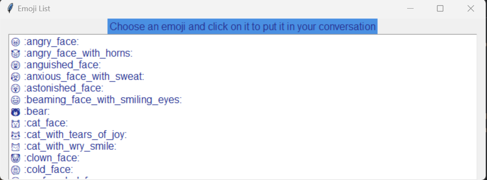
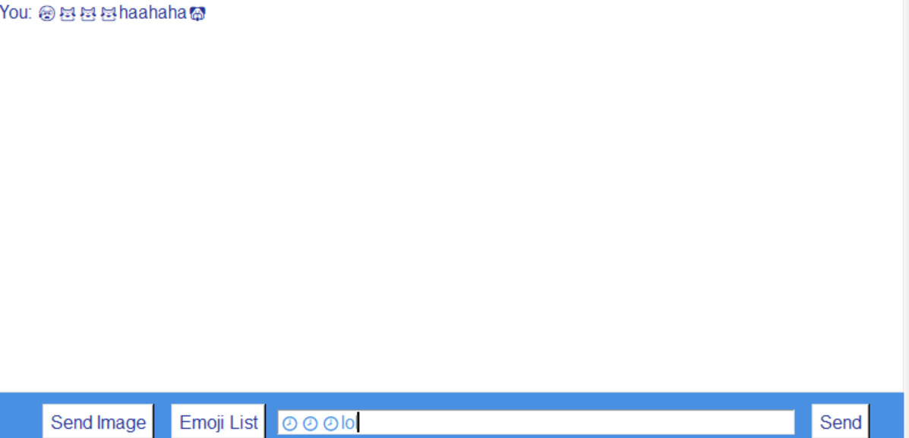

# Messenger

## Overview
This messenger app allows clients to log in and communicate through text, images, and emojis. It's designed to be user-friendly and efficient for daily communications.

## Installation
To install the app, you'll need Python 3.9. Follow these steps:
1. Clone the repository: `git clone https://github.com/carinaioana/Messenger.git`
2. Navigate to the project directory: `cd Messenger`
3. Install the required dependencies: 
`sudo apt-get install python3-tk`
`pip install emoji` 
`pip install pillow`
`pip install cryptography`

## Usage
After installation, run the app using `python server.py` from directory server 
and then `python client.py` from client directory (you can start multiple clients). 
To use the messenger:
1. Create an account to log in writing your client id and pressing the `Login` button/`Enter`. 
2. Use the chat interface to send texts, images, and emojis to other users.

    ### Sending Text to Everyone
    - simply write text in the entry box at the bottom of the page and press `Send`/`Enter`
    ### Sending Text in Private
    - you need to use this format: `/private` `clientID` `text...`
    ### Sending Images
      - press `Send Image` and then it opens up a window with two options:`Send Privately` or `Send to Everyone`
      - if you choose `Send Privately` it opens up another window where you need to write the `clientID` you want to send the image to
      - after selecting your option it opens up your Documents where you can select only images with .jpg and .png format
      - you can select only one photo at a time
    ### Sending Emojis
    - press `Emoji List` and it opens up a window with an entire list of emoji and their description
    - you have the exact instructions there written: `Choose an emoji and click on it to put it in your conversation`
    - selected emojis are inserted directly into the chat input field
    - emojis are displayed inline with text messages in the chat window

## Interface Built with Tkinter
This application's user interface is built using Tkinter, a standard GUI toolkit for Python. The interface includes features such as:
- Login screen
- Message entry box
- Display area for chat messages

Here's a snippet showcasing the initialization of the Tkinter interface:
```
class ChatApplication:
    def __init__(self):
        ...
        self.create_login_widgets()
    def create_login_widgets(self):
        ...
    def create_chat_window(self):
        ...
    
if __name__ == "__main__":
    chat_app = ChatApplication()
    tk.mainloop()
```
## Communication via Socket Programming
The app uses socket programming for client-server communication. Here are the key aspects:

- Establishes a socket connection using the IP 127.0.0.1 and port 55555.
```
host = '127.0.0.1'
port = 55555
```
- Handles sending and receiving messages over the network.
    ### Multithreading for Concurrent Processes
    Multithreading is implemented to ensure smooth and concurrent operations, such as sending and receiving messages simultaneously between multiple clients.
    This approach enhances the user experience by allowing real-time communication without interface freezing.
    ```
        threading.Thread(target=handle_client, args=(client,), daemon=True).start()
    ```
    I used daemon threads to allow background tasks, like client communication, 
    to run without obstructing the main program execution and terminate automatically when the main program ends. 

## Logging
Logging is set up for the application, facilitating debugging and tracking messages.
Logs are stored in `files/client.log` and in `server_chat_history/server_chat_history.log`
```
logging.basicConfig(level=logging.INFO,
                            format='%(asctime)s - %(levelname)s - %(message)s',
                            filename='files/client.log',
                            filemode='a')
```
Error-handling
```
 try
 ...
 except Exception as e:
            logging.error(f"Unexpected error in send_message: {e}")
```
    
## Security Features
Encryption: The app uses `cryptography.fernet` for symmetric encryption, 
ensuring secure message and image transmission.

### Key Management:

Unique Fernet keys are generated per session for encrypting/decrypting data.
The same key encrypts and decrypts data, maintaining confidentiality and integrity.

Advantages: Ensures data is readable only by intended recipients.
Protects data integrity during transmission.

## Image Handling:

- Sending: Images are selected and read as binary data, encoded in `base64` to ensure safe transmission over the network.
- Receiving: Upon arrival, the `base64` data is decoded back into binary form.
- Displaying: The binary data is converted into a displayable image format using the `PIL` library.
- Supported Formats: The app handles common image formats like `JPG` and `PNG`.

## Screenshots for visual aid



